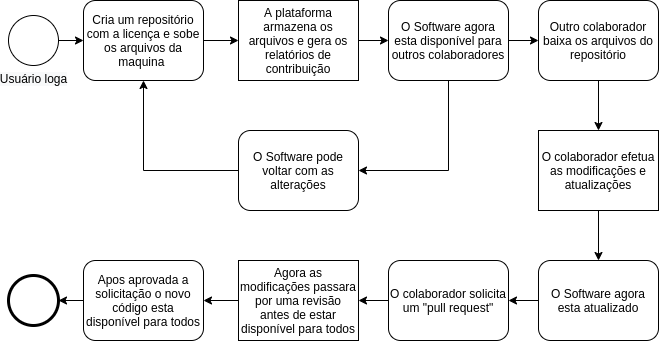
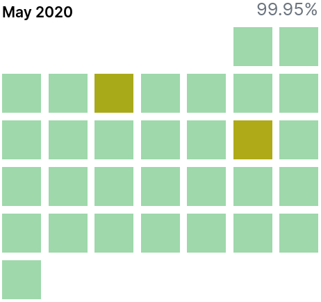
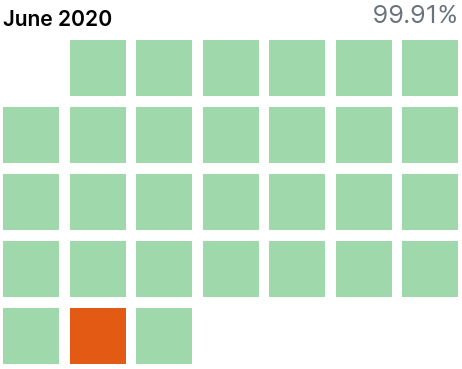

### Informações sobre a empresa.

**Nome:**

GitHub, Inc.

**Endereço:**

88 Colin P Kelly Jr St San Francisco, CA 94107.**

**Cidade:**

San Francisco.

**Atua no mercado desde:**

8 de fevereiro de 2008.

**Possui filiais?**

Sim, a Good software LLC, NPM inc. Semmle ltd.

**Qual é área de negócio?**

Software e prestadora de serviços.

**Para qual área há um número maior de pedidos de sistemas?**

Empresas de Software, E-Commerce e empresas de streaming.

**Quais os softwares considerados mais importantes da empresa?**

A plataforma Github com os serviços GitHub actions, Enterprise Server e GitHub Packages, além da IDE Atom e o framework Electron.

**Qual é a quantidade de usuários que utilizam esse software?**

Em agosto de 2019 a plataforma atingiu 40 milhões de usuários cadastrados.

**Quais impactos na empresa ocorrem quando há indisponibilidade do sistema?**

O core business da empresa é comprometido, o desempenho da plataforma é reduzido em caso de redundância, e em queda do sistema a empresa sofre com o impacto financeiro.

**O desenvolvimento de sistemas é para qual plataforma?**

Github desenvolve Software com foco em todas as plataformas e sistemas operacionais.

**Quais as linguagens de programação utilizadas pela empresa para o desenvolvimento de sistemas?**

C, Shell, Ruby, Erlang, javascript entre outras.

**Qual é a mais utilizada?**

Ruby.

**Os softwares desenvolvidos utilizam quais banco de dados?**

MySQL.

**A equipe de desenvolvimento utiliza alguma ferramenta para projeto de banco de dados?**

Não.

**Que tecnologias de desenvolvimento Web são utilizadas?**

Html/Javascript, Ruby on Rails.

**Quais são os requisitos mínimos exigidos para fazer parte da equipe?**

Desejável experiência prévia.

**Qual é a frequência de atualização dos sistemas desenvolvidos pela empresa?**

Os Software da empresa estão em constante atualização.

**Qual é o ciclo de vida de um software novo na empresa?**

Github trabalha com a política de software aberto, os software e produtos estão em constante atualização.

**Quem são os principais clientes da empresa?**

Airbnb, Netflix, Shopify, Instacart, Reddit, StackShare, Lyft, Robinhood.
 
**De onde são os clientes?**

Clientes se encontra espalhado por todo o mundo.

**Quem são os principais fornecedores da empresa?**

A Amazon fornece os servidores AWS para hospedar GitHub.

**Qual é o tipo de acesso?**

Dedicada, por fibra-óptica.

**Qual a velocidade?**

Mais de 100Gb/s

**Possui Datacenter próprio?**

A empresa opera as próprias instalações Data Centers com a arquitetura spoke-hub.

**Quais plataformas de equipamentos utiliza?**

Cloud, Mainframe, Servidores dedicados, Cloud Híbrida.

**Qual é o volume de informações armazenadas (ordem de grandeza) nos bancos de dados e/ou servidores da empresa?**

o volume de dados armazenado é desconhecido publicamente, mas passa de petabytes

**Quais são os mecanismos de segurança utilizados?**

Autenticação por dois fatores, protocolos SSH e HTTP, LDAP, SAML, uso de chaves GPG.

**Quais são as expectativas da empresa para 2020/2021?**

Github pretende trazer uma série de novidades para seus usuários em 2020 dentre elas:

**Codespaces: Um ambiente de desenvolvimento completo no GitHub que permite contribuir imediatamente.**

**GitHub Discussions: Uma nova maneira de as comunidades de software colaborarem fora da base de código.**

### Fluxo de informação



### Classificação desse sistema de informação

**Pirâmide Organizacional**


**Nível Operacional:**
Sistema de processamento de informações: GitHub oferece uma maneira fácil e rápida de analisar os códigos de uma empresa, guardando em seu banco de dados todas as modificações feitas e quem as modificou(os commits).

**Nível Tático:**
Sistema de informações gerenciais: O GitHub oferece uma análise gráfica das contribuições dos funcionários, sintetizando os dados provido dos “commits” e “pull request”. e também através de uma planilha KanBan integrada é possível monitorar o que cada funcionário está fazendo.

**Sistema complexo:**

* Entradas: Código fonte, desenho do projeto, manual de uso, fórum de discussão, informações sobre o projeto e servidor de hospedagem.

* Processamento: Versionamento do projeto, deploy, revisão do código e merge das alterações.

* Saída: Repositório principal com integração contínua e entrega contínua.

**Sistema fechado:**

GitHub é uma plataforma de código fechado que toma decisões próprias.

**Sistema dinâmico(adaptável):**

GitHub é uma plataforma em constante desenvolvimento, acompanhado o mercado.

**Sistema permanente:**
Recentemente adquirido pela Microsoft, GitHub se tornou a plataforma mais popular e estável conhecida para gerenciamento de repositórios git.

### Dimensões do Sistema

**Organização:**

O GitHub segue uma organização plana(ou horizontal) na qual possui uma estrutura organizacional com poucos ou nenhum nível de gerência intermediária entre funcionários e executivos, uma empresa flexível em constante mudança. GitHub apresenta uma cultura amigável com foco na saúde de seus funcionários e na diversificação.

**Pessoas:**

O GitHub conta com mais de 40 milhões de usuários e uma comunidade forte e ativa que mantém a plataforma viva. Seus funcionários são constantemente incentivados a estudar e se desenvolver, para isso o GitHub oferece um orçamento anual para a equipe alcançar seus objetivos.

**Tecnologia:**

A principal tecnologia do GitHub é o Git um software open source para versionamento, além de contar com uma estrutura de servidores grande rodando MySQL  é um dos sites mais visitados no mundo.

### Informações que o GitHub detém e a segurança de dados

O GitHub criptografa todos os dados em trânsito, todas as informações e credenciais de login estão sempre protegidas. O GitHub armazena um hash unidirecional de todas as senhas de usuários usando bcrypt. O login da sua conta está protegido contra ataques de força bruta. Além de estarem de acordo com o regulamento geral sobre proteção de dados.

**As informações que o GitHub coleta são:**

* Informações de registro: qualquer informações exigidas na criação de uma conta como endereço de email, senhas, IP e nome real.

* Informação de pagamento: Caso venha a apoiar algum projeto ou contrate algum serviço do GitHub, o mesmo coleta seu nome completo, endereço e informações de cartão de crédito ou informações do PayPal. mas não armazena nem processa esses dados.

* Informações de uso: informações sobre como você usa o Serviço, como as páginas exibidas, o site de referência, o endereço IP e as informações da sessão e a data e hora de cada solicitação.

### Disponibilidade

**Disponibilidade do GitHub nos últimos 2 meses, maio e junho de 2020**





5 May 2020: interrupção parcial de 28 minutos

15 May 2020: interrupção parcial de 33 minutos

29 Jun 2020: interrupção parcial de 2 horas e 6 minutos

> **Calculo de Disponibilidade de um sistema**
>
> ```Disponibilidade = MTBF/(MTBF+MTTR)```
>
> MTBF: Mean Time Between Failures (Tempo médio entre falhas).
>
> MTTR: Mean Time To Repair (tempo médio de reparo).

### Disponibilidade do GitHub Enterprise Server

O GitHub Enterprise Server dá suporte ao modo de alta disponibilidade. Algumas das configurações de alta disponibilidade são:

* Criar réplica de servidores: o appliance réplica é uma cópia redundante do appliance primário. Em caso de falha no appliance primário, o modo de alta disponibilidade permitirá que a réplica atue como appliance primário, mitigando as interrupções de serviço.

* Iniciar um failover do appliance: É possível fazer failover de um appliance réplica do GitHub Enterprise Server  em caso de falha do appliance primário

* Recuperar a configuração de alta disponibilidade: Após o failover para um appliance do GitHub Enterprise Server, desejável recuperar a redundância o quanto antes, em vez de usar somente um appliance.

* Replicação Geográfica: A replicação geográfica no GitHub Enterprise Server usa várias réplicas ativas para atender às solicitações de datacenters distribuídos geograficamente.

**Clustering do GitHub**

O GitHub Enterprise Server é formado por um conjunto de serviços. Em um cluster, esses serviços são executados em vários nós e as solicitações são balanceadas por carga entre eles. As alterações são armazenadas automaticamente com cópias redundantes em nós separados. A maioria dos serviços são pares iguais com outras instâncias do mesmo serviço. O clustering foi feito para situações específicas de dimensionamento e não se aplica a todas as organizações.

Cenários de falha:

* Tanto a alta disponibilidade (High Availability, HA) quanto o cluster fornecem redundância ao eliminar o nó único como ponto de falha. Ambos podem fornecer disponibilidade nos seguintes cenários:

* Falhas de software , devido a falha do sistema operacional ou aplicativos irrecuperáveis.

* Falhas de hardware , incluindo hardware de armazenamento, CPU, RAM, interfaces de rede, etc.

* Falhas no sistema host de virtualização , incluindo eventos de manutenção não planejados e agendados na AWS .

* Rede separada lógica ou fisicamente , se o dispositivo de failover estiver em uma rede separada não afetada pela falha.

**Recovery Time Objective (RTO):** Segundo a AWS(Provedora do GitHub) o RTO é garantido em minutos através da conversão e a orquestração altamente automatizadas de máquinas.

**Recovery Point Objective(RPO):** O RPO em caso de falha é uma escolha da empresa, o ponto de backup é agendado através de um comando ou um serviço de agendamento, caso o agendamento seja feito a cada dia os dados perdidos serão de no máximo 24h, o GitHub recomenda backup de 1 em 1 hora


**Incidente do dia 21 de outubro de 2018**

No dia 21 de Outubro às 10:52 UTF, embora parte da plataforma não tenha sido afetada por esse incidente vários sistemas internos foram afetados o que resultou na exibição de informações inconsistente ou desatualizada, por fim nem um dado dos usuários foram perdidos ou comprometidos. Às 22:52 UTC de 21 de outubro, o trabalho de manutenção de rotina para substituir o equipamento óptico 100G com falha resultou na perda de conectividade entre o hub de rede da costa leste dos EUA e o data center principal da costa leste dos EUA. A conectividade entre esses locais foi restaurada em 43 segundos, mas essa breve interrupção acionou uma cadeia de eventos que levaram a 24 horas e 11 minutos de interrupção do serviço.


O GitHub usa um Orchestrator para gerenciar as topologias de cluster MySQL e lidar com failover automatizado. O Orchestrator considera várias variáveis durante esse processo e é construído sobre o Raft para obter consenso.


### TODAS AS INFORMAÇÕES FORAM TIRADAS DO SITE GITHUB DA WIKIPEDIA NOS LINKS:

[docs.github.com](docs.github.com)

[github.com/about](github.com/about)

[en.wikipedia.org/wiki/GitHub](en.wikipedia.org/wiki/GitHub)

[github.blog/2017-10-12-evolution-of-our-data-centers](github.blog/2017-10-12-evolution-of-our-data-centers)

[github.blog/2018-10-21-october21-incident-report](github.blog/2018-10-21-october21-incident-report)

[github.blog/2018-06-20-mysql-high-availability-at-github](github.blog/2018-06-20-mysql-high-availability-at-github)

[github.blog/2016-12-08-orchestrator-github](github.blog/2016-12-08-orchestrator-github)

[github.blog/2018-10-30-oct21-post-incident-analysis](github.blog/2018-10-30-oct21-post-incident-analysis)

[resources.github.com/downloads/github-guide-to-organizations.pdf](resources.github.com/downloads/github-guide-to-organizations.pdf)

[githubstatus.com](githubstatus.com)

